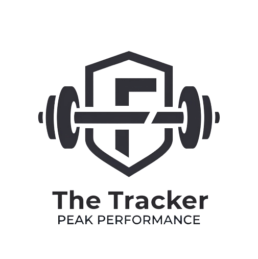
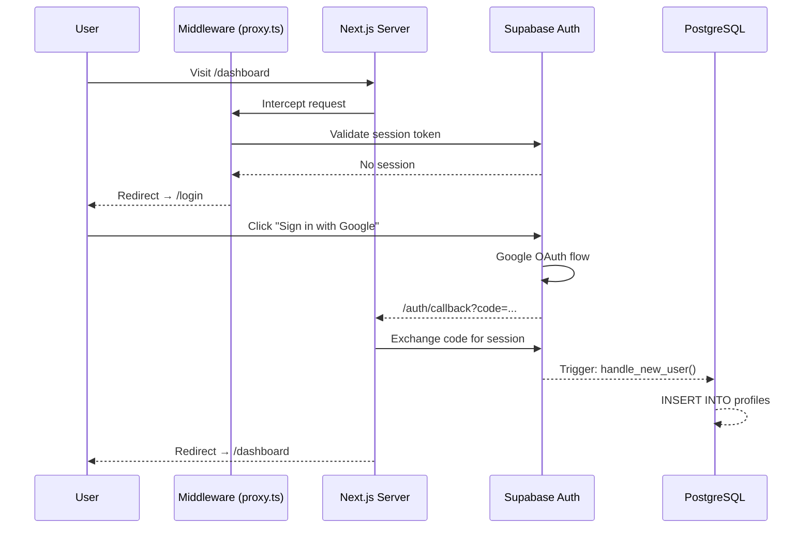
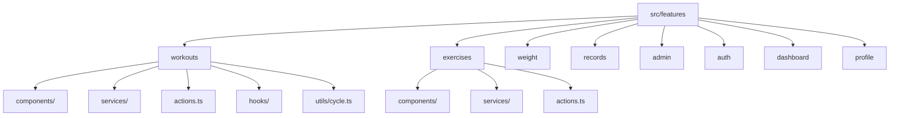
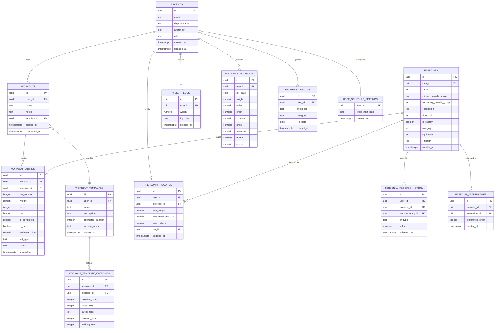

<div align="center">



# THE TRACKER

### *Track. Improve. Repeat.*

**A personal athlete performance platform built around a structured Upper & Lower hypertrophy split.**

<br />

[](https://nextjs.org/)
[](https://reactjs.org/)
[](https://www.typescriptlang.org/)
[](https://supabase.com/)
[](https://tailwindcss.com/)
[](https://vercel.com/)

<br />

[](https://github.com/HusseinA-H/THE-TRACKER)
[](LICENSE)
[](https://github.com/HusseinA-H/THE-TRACKER/commits)
[](#-database-schema)
[](#-project-structure)

<br />

[**Live Demo**](https://github.com/HusseinA-H/THE-TRACKER) · [**Report Bug**](https://github.com/HusseinA-H/THE-TRACKER/issues) · [**Request Feature**](https://github.com/HusseinA-H/THE-TRACKER/issues)

</div>

---

## 📋 Table of Contents

- [About the Project](#-about-the-project)
- [Features](#-features)
- [Tech Stack](#-tech-stack)
- [Architecture](#-architecture)
- [Database Schema](#-database-schema)
- [Screenshots](#-screenshots)
- [Project Structure](#-project-structure)
- [Challenges & Solutions](#-challenges--solutions)
- [Security](#-security)
- [Future Roadmap](#-future-roadmap)
- [Installation](#-installation)
- [Environment Variables](#-environment-variables)
- [Deployment](#-deployment)
- [Credits](#-credits)

---

## 🎯 About the Project

### The Problem with Generic Fitness Apps

Every mainstream fitness app — MyFitnessPal, Strong, Hevy, Boostcamp — is built for a mass audience. They ship bloated feature sets, push subscriptions, and offer zero customization for athletes who follow structured periodized programs.

When you follow a specific **Upper & Lower hypertrophy split** with a fixed exercise rotation, rep targets, and a rolling 10-day cycle, generic apps become friction — not tools.

### Why THE TRACKER Was Built

THE TRACKER was designed from the ground up as a **personal training ecosystem**, not a SaaS product. It is tailored to one specific methodology:

- **6 predefined workout templates** (`Upper A`, `Lower A`, `Upper B`, `Lower B`, `Upper C`, `Cardio + Abs`)
- A **rolling 10-day cycle** with rest days mapped to the training schedule
- **Automatic progression suggestions** based on previous performance
- **PR detection in real-time** during active workout sessions

The philosophy is simple: **the best tracking tool is the one built for you**.

### Inspiration

THE TRACKER takes inspiration from three category-defining apps:

| App | What it does well | What THE TRACKER improves |
|-----|------------------|--------------------------|
| **Strong** | Clean workout logger | Custom templates + cycle tracking |
| **Hevy** | Exercise history & PRs | Real-time PR detection + suggestions |
| **Boostcamp** | Coach-prescribed programs | Fully customized to personal split |

---

## ✨ Features

<details>
<summary><strong>🔐 Authentication System</strong></summary>

- **Google OAuth 2.0** via Supabase Auth for zero-friction sign-in
- Automatic profile creation via PostgreSQL database trigger on first login
- JWT session management with secure HTTP-only cookie storage
- Middleware-based route protection — unauthenticated users are redirected to `/login`
- Authenticated users are redirected away from `/login` to `/dashboard`

</details>

<details>
<summary><strong>💪 Exercise Library</strong></summary>

- Global system exercise library managed by admins
- Exercises categorized as **Upper**, **Lower**, or **Cardio**
- Muscle group tagging (`Chest`, `Back`, `Legs`, `Shoulders`, `Arms`, `Core`, `Cardio`)
- Searchable, filterable exercise table with clean data presentation
- Admin CRUD for adding/editing/removing global movements
- Video reference URL management per exercise
- **Exercise Alternatives** — up to 3 ordered swap options per movement

</details>

<details>
<summary><strong>📋 Workout Templates</strong></summary>

Six predefined system templates seeded directly from the athlete's training program:

| Template | Focus | Est. Duration | Exercises |
|----------|-------|---------------|-----------|
| Upper A | Chest, Back, Shoulders, Triceps | 60 min | 8 |
| Lower A | Quads, Hamstrings, Glutes, Calves | 50 min | 5 |
| Upper B | Shoulders, Arms, Forearms | 65 min | 9 |
| Lower B | Hamstrings, Quads, Calves | 50 min | 5 |
| Upper C | Chest, Back, Arms, Traps | 60 min | 9 |
| Cardio + Abs | Core, Cardio | 45 min | 7 |

</details>

<details>
<summary><strong>🏋️ Active Workout Logger</strong></summary>

- Launch any template and auto-populate all exercises with target sets/reps
- **Real-time progression suggestions** — last weight/reps displayed next to every set input
- Set type classification: `warmup`, `working`, `top`, `failure`
- Built-in **rest timer** with configurable countdown (default 90s)
- **PR detection overlay** — gold badge fires when a new personal record is set mid-session
- Exercise swap mid-workout using configured alternatives
- **Exercise Detail Drawer** with tabs: Overview · History · Notes · Alternatives
- Progress bar tracking sets completed vs. total
- Workout notes field with auto-save
- Cancel or finish with confirmation dialogs

</details>

<details>
<summary><strong>📊 Personal Records & Progression</strong></summary>

- Automatic PR tracking per exercise: max weight, max volume, max estimated 1RM
- **Epley Formula** for estimated 1RM calculation: `weight × (1 + reps/30)`
- PR history table with date, weight, reps, and PR type
- Suggested next weight computed from previous best performance
- PRs persist across all workouts — always the all-time best

</details>

<details>
<summary><strong>📅 Training Calendar</strong></summary>

- Month-view calendar showing every day's scheduled training slot
- Cycle days computed from a configurable **cycle start date**
- Visual indicators: ✅ Completed · ❌ Missed · 🛌 Rest Day · 📌 Today
- Rolling 10-day cycle pattern: `Upper A → Lower A → Rest → Upper B → Lower B → Rest → Upper C → Rest → Cardio + Abs → Rest`
- Weekly streak tracking (current streak & longest streak)

</details>

<details>
<summary><strong>⚖️ Weight Tracking</strong></summary>

- Daily body weight logging with date picker
- Interactive Recharts line graph with trend visualization
- Weight difference stats vs. starting weight
- Historical log table with delete capability
- Weight entries auto-synced to body measurements table

</details>

<details>
<summary><strong>📏 Body Measurements</strong></summary>

- Log circumference measurements: waist, chest, shoulders, arms, forearms, thighs, calves
- Metric chart with selectable views: weight · waist · arms · chest
- Trend badges (↑ gain, ↓ loss) with colour coding
- Bi-directional sync trigger between `weight_logs` and `body_measurements`

</details>

<details>
<summary><strong>🛡️ Admin Panel</strong></summary>

- Role-based access: `admin` and `super_admin` roles
- Server-side guard via `verifyAdmin()` — unauthorized access throws a 403
- Navigation items (sidebar, dropdown, mobile) only visible to admin users
- **Admin tabs:**
  - **Overview** — system stats (users, workouts, exercises, weight logs, PRs)
  - **Workout Programs** — create/edit/delete workout packages and assign templates
  - **Alternatives** — configure per-exercise swap options (up to 3, preference-ordered)
  - **Videos** — bulk-assign YouTube/coaching video URLs to exercises
  - **System Settings** — global app configuration

</details>

---

## 🛠 Tech Stack

### Frontend

| Technology | Version | Purpose |
|-----------|---------|---------|
| **Next.js** | 16.2.7 | Full-stack React framework (App Router) |
| **React** | 19.2.4 | UI component library |
| **TypeScript** | 5.x | Static typing throughout |
| **Tailwind CSS** | 4.x | Utility-first styling |
| **shadcn/ui** | 4.10.0 | Accessible component primitives |
| **Lucide React** | 1.17.0 | Icon system |
| **Recharts** | 3.8.1 | Interactive data charts |
| **Sonner** | 2.0.7 | Toast notification system |
| **React Hook Form** | 7.77.0 | Form state management |
| **Zod** | 4.4.3 | Schema validation |
| **date-fns** | 4.4.0 | Date arithmetic and formatting |

### Backend & Infrastructure

| Technology | Purpose |
|-----------|---------|
| **Supabase** | Backend-as-a-Service (auth, database, storage) |
| **PostgreSQL** | Relational database with RLS |
| **Supabase Auth** | Google OAuth 2.0 provider |
| **Supabase Storage** | Progress photo file storage |
| **Next.js Server Actions** | Secure server-side mutations |
| **Next.js Middleware** | Route protection proxy |
| **Vercel** | Edge deployment |

---

## 🏗 Architecture

### Application Architecture

```
┌──────────────────────────────────────────────────┐
│                    BROWSER                        │
│   ┌──────────────────────────────────────────┐   │
│   │           Next.js App Router             │   │
│   │   ┌────────────┐  ┌──────────────────┐  │   │
│   │   │  Server    │  │   Client         │  │   │
│   │   │ Components │  │  Components      │  │   │
│   │   │ (RSC)      │  │  (use client)    │  │   │
│   │   └─────┬──────┘  └────────┬─────────┘  │   │
│   │         │                  │             │   │
│   │   ┌─────▼──────────────────▼─────────┐  │   │
│   │   │        Server Actions             │  │   │
│   │   │   (Secure mutations, no API)      │  │   │
│   │   └─────────────────────┬────────────┘  │   │
│   └─────────────────────────┼───────────────┘   │
└─────────────────────────────┼────────────────────┘
                              │
                    ┌─────────▼─────────┐
                    │    Supabase       │
                    │  ┌─────────────┐  │
                    │  │ PostgreSQL  │  │
                    │  │    + RLS    │  │
                    │  └─────────────┘  │
                    │  ┌─────────────┐  │
                    │  │ Supabase    │  │
                    │  │   Auth      │  │
                    │  └─────────────┘  │
                    │  ┌─────────────┐  │
                    │  │  Storage    │  │
                    │  │  (Photos)   │  │
                    │  └─────────────┘  │
                    └───────────────────┘
```

### Authentication Flow



### Feature-Based Architecture

The codebase follows a **feature-based modular structure** where all business logic, components, services, and actions for a feature are colocated:



### Server Action Pattern

All data mutations use Next.js Server Actions — no custom API routes required:

```typescript
// Pattern: Server Action returns discriminated union
type ActionResult<T> =
  | { success: true; data: T }
  | { success: false; error: string };

// Called directly from client components
const result = await completeWorkoutAction(workoutId);
if (result.success) {
  toast.success("Workout complete!");
} else {
  toast.error(result.error);
}
```

---

## 🗃 Database Schema

### Entity Relationship Diagram



### Migration History

| # | Migration | Description |
|---|-----------|-------------|
| 01 | `create_tables.sql` | Core schema: profiles, exercises, workouts, entries, weight_logs, PRs |
| 02 | `rls_policies.sql` | Row-Level Security policies for all tables |
| 03 | `triggers.sql` | `handle_new_user()` trigger for auto profile creation |
| 04 | `indexes.sql` | Performance indexes on foreign keys and date columns |
| 05 | `add_role_to_profiles.sql` | RBAC: `role` column with `user/admin/super_admin` enum |
| 06 | `update_exercise_rls_policies.sql` | Exercise visibility policies (public system vs. private custom) |
| 07 | `add_exercise_fields.sql` | Added `category`, `equipment`, `difficulty`, `notes` to exercises |
| 08 | `workout_templates.sql` | Templates + template_exercises tables + full seed data |
| 09 | `refine_workout_system.sql` | Workout packages, package-template relationships |
| 10 | `athlete_upgrade_system.sql` | Alternatives, PR history, body measurements, photos, schedule |
| 11 | `progress_photos_bucket.sql` | Supabase Storage bucket RLS policies |

### Key Database Triggers

```sql
-- Auto-creates user profile on first Google OAuth sign-in
CREATE TRIGGER on_auth_user_created
  AFTER INSERT ON auth.users
  FOR EACH ROW EXECUTE FUNCTION public.handle_new_user();

-- Bi-directional sync: weight_logs ↔ body_measurements
CREATE TRIGGER trigger_sync_weight_to_measurements
  AFTER INSERT OR UPDATE OF weight ON public.weight_logs
  FOR EACH ROW EXECUTE FUNCTION public.sync_weight_to_measurements();
```

---

## 📸 Screenshots

> **Note:** Screenshots are captured from the live production deployment.

### Landing Page
| Section | Description |
|---------|-------------|
| `public/screenshots/landing.png` | Hero section with tagline, feature list, and Google sign-in CTA |

### Dashboard Home
| Section | Description |
|---------|-------------|
| `public/screenshots/dashboard.png` | Stats cards (current weight, last workout, total PRs, weekly activity) |

### Exercise Library
| Section | Description |
|---------|-------------|
| `public/screenshots/exercises.png` | Searchable table with Name · Category · Primary Muscle columns |

### Workout Templates
| Section | Description |
|---------|-------------|
| `public/screenshots/workouts.png` | 6 template cards with muscle focus, duration, and Start Workout CTA |

### Active Workout Session
| Section | Description |
|---------|-------------|
| `public/screenshots/active-workout.png` | Live logger with progression hints, set rows, rest timer, PR badge |

### Exercise Detail Drawer
| Section | Description |
|---------|-------------|
| `public/screenshots/exercise-drawer.png` | Overview · History · Notes · Alternatives tabs |

### Weight Tracker
| Section | Description |
|---------|-------------|
| `public/screenshots/weight.png` | Recharts line graph, daily log form, history table |

### Personal Records
| Section | Description |
|---------|-------------|
| `public/screenshots/records.png` | PR table: max weight, estimated 1RM, last logged date |

### Training Calendar
| Section | Description |
|---------|-------------|
| `public/screenshots/calendar.png` | Month grid with cycle day labels and completed/missed indicators |

### Admin Panel
| Section | Description |
|---------|-------------|
| `public/screenshots/admin.png` | Tabbed dashboard: Overview · Programs · Alternatives · Videos · Settings |

---

## 📁 Project Structure

```
the-tracker/
│
├── src/
│   ├── app/                          # Next.js App Router pages
│   │   ├── (auth)/                   # Auth route group
│   │   │   └── auth/callback/        # OAuth callback handler
│   │   ├── administration/           # Admin-only pages
│   │   │   ├── analytics/            # Platform analytics
│   │   │   ├── exercises/            # Exercise library management
│   │   │   ├── packages/             # Workout package management
│   │   │   ├── settings/             # System settings
│   │   │   ├── templates/            # Template management
│   │   │   ├── users/                # User management + [id]
│   │   │   ├── layout.tsx            # Admin sidebar layout
│   │   │   └── page.tsx              # Admin dashboard (tabs)
│   │   ├── dashboard/                # Athlete dashboard pages
│   │   │   ├── calendar/             # Training calendar view
│   │   │   ├── exercises/            # Exercise library
│   │   │   ├── measurements/         # Body measurements
│   │   │   ├── photos/               # Progress photos
│   │   │   ├── profile/              # User profile
│   │   │   ├── records/              # Personal records
│   │   │   ├── schedule/             # Rotation schedule
│   │   │   ├── weight/               # Weight tracking
│   │   │   ├── workouts/             # Workout templates + [id] + active
│   │   │   ├── layout.tsx            # Dashboard sidebar layout
│   │   │   └── page.tsx              # Dashboard home
│   │   ├── globals.css               # Global styles + CSS variables
│   │   ├── layout.tsx                # Root layout (providers)
│   │   └── page.tsx                  # Landing page (/)
│   │
│   ├── components/                   # Shared UI components
│   │   ├── layout/                   # Sidebar, header, page-header
│   │   └── ui/                       # shadcn/ui primitives
│   │
│   ├── config/
│   │   ├── routes.ts                 # Route constants + public route list
│   │   └── site.ts                   # App metadata, muscle groups, defaults
│   │
│   ├── features/                     # Feature-based modules
│   │   ├── admin/                    # Admin panel
│   │   │   ├── components/           # Dashboard tabs, managers, forms
│   │   │   ├── services/             # Admin data fetching
│   │   │   ├── actions.ts            # Admin server actions
│   │   │   ├── schemas.ts            # Zod validation schemas
│   │   │   └── security.ts           # verifyAdmin() + verifySuperAdmin()
│   │   ├── auth/                     # Auth components (login page)
│   │   ├── dashboard/                # Dashboard home stats
│   │   ├── exercises/                # Exercise library
│   │   │   ├── components/           # Table, drawer, detail view
│   │   │   ├── services/             # Exercise + alternatives services
│   │   │   └── actions.ts            # Exercise CRUD actions
│   │   ├── profile/                  # User profile management
│   │   ├── records/                  # Personal records
│   │   │   ├── components/           # Records table, PR history
│   │   │   └── services/             # Records fetching
│   │   ├── weight/                   # Weight + measurements + photos
│   │   │   ├── components/           # Charts, forms, history tables
│   │   │   ├── services/             # Weight, measurements, photos services
│   │   │   └── actions.ts / photo-actions.ts
│   │   └── workouts/                 # Core workout system
│   │       ├── components/           # Active logger, template cards, calendar
│   │       ├── hooks/                # useRestTimer
│   │       ├── services/             # workout-service, schedule-service
│   │       ├── utils/cycle.ts        # CYCLE_DAYS + calculateCycleDay()
│   │       └── actions.ts            # All workout server actions
│   │
│   ├── lib/
│   │   ├── supabase/                 # Supabase client (server + browser)
│   │   └── utils.ts                 # cn(), formatDate(), ActionResult type
│   │
│   ├── providers/                    # React context providers
│   ├── proxy.ts                      # Next.js middleware (auth guard)
│   └── types/
│       ├── index.ts                  # Application domain types
│       └── database.types.ts         # Generated Supabase types
│
├── supabase/
│   ├── migrations/                   # 11 sequential SQL migrations
│   └── seed.sql                      # Exercise library seed data
│
├── public/                           # Static assets
├── next.config.ts                    # Next.js configuration
├── tailwind.config.ts                # Tailwind configuration
└── package.json
```

---

## ⚔️ Challenges & Solutions

<details>
<summary><strong>1. Supabase Profile Trigger — Missing `display_name` column</strong></summary>

**Problem:** The `handle_new_user()` trigger was referencing `full_name` from the Google OAuth metadata, but the profiles table column was named `display_name`. New users triggered a PostgreSQL constraint violation.

**Root Cause:** Column naming mismatch between the trigger function and the schema definition. Google OAuth stores the user's name as `raw_user_meta_data->>'full_name'`.

**Solution:**
```sql
CREATE OR REPLACE FUNCTION public.handle_new_user()
RETURNS TRIGGER AS $$
BEGIN
  INSERT INTO public.profiles (id, email, display_name, avatar_url)
  VALUES (
    NEW.id,
    NEW.email,
    COALESCE(NEW.raw_user_meta_data->>'full_name', NEW.email),
    NEW.raw_user_meta_data->>'avatar_url'
  )
  ON CONFLICT (id) DO NOTHING;
  RETURN NEW;
END;
$$ LANGUAGE plpgsql SECURITY DEFINER;
```

**Result:** All new Google OAuth users now receive an automatic profiles row on first sign-in.

</details>

<details>
<summary><strong>2. Next.js Middleware — `matcher` + Auth Session Refresh</strong></summary>

**Problem:** After upgrading to Next.js 15+, the previous `middleware.ts` file pattern broke. Session cookies were not being refreshed on server-rendered pages, causing users to be shown stale auth states.

**Root Cause:** The `@supabase/ssr` package requires middleware to call `supabase.auth.getUser()` on every request to refresh the session token — the old pattern only checked for the cookie presence.

**Solution:** Created `src/proxy.ts` with the full Supabase SSR cookie refresh pattern and imported it from `middleware.ts`. Used a precise `matcher` regex to exclude static assets from middleware processing.

**Result:** Sessions refresh correctly on every server render. No stale auth states.

</details>

<details>
<summary><strong>3. React Hydration Mismatch — Client/Server Render Difference</strong></summary>

**Problem:** Console warned `Hydration failed because the server rendered HTML didn't match the client`. Several components conditionally rendered based on `Date.now()` or `new Date()`, which produced different values between server and client.

**Root Cause:** Server components that used `new Date()` for "today" checks rendered a different date than what the client computed after hydration.

**Solution:** Passed date strings as props from server components to client components, avoiding any `new Date()` calls at the client boundary. Used `useEffect` for client-only date-dependent UI.

**Result:** Zero hydration warnings in development and production builds.

</details>

<details>
<summary><strong>4. Workout Template Migration — Duplicate Version Numbers</strong></summary>

**Problem:** Two migrations were both numbered `00007_`, causing Supabase to reject the migration chain:
- `00007_add_exercise_fields.sql`
- `00007_workout_templates.sql`

**Root Cause:** When creating the workout templates migration, the next available version was not audited.

**Solution:** Renumbered the workout templates migration to `00008_workout_templates.sql` and verified the full sequential chain from 01–11.

**Result:** Clean migration history with no conflicts.

</details>

<details>
<summary><strong>5. Admin RBAC — Server-Side Role Verification</strong></summary>

**Problem:** Initial implementation only hid admin UI elements on the frontend — there was no server-side guard. A user could navigate directly to `/administration` and access admin data.

**Root Cause:** Role-based access was enforced client-side only (conditional rendering), which is not secure.

**Solution:** Created `src/features/admin/security.ts` with `verifyAdmin()` and `verifySuperAdmin()` functions that:
1. Fetch the authenticated user from Supabase
2. Query the `profiles` table for the user's `role`
3. Throw a `403 Forbidden` error if the role is not `admin` or `super_admin`

These functions are called at the top of every admin server component and server action.

**Result:** Double-layer protection: UI hides admin items, server blocks unauthorized access.

</details>

<details>
<summary><strong>6. Missing `parseISO` Import — TypeScript Build Failure</strong></summary>

**Problem:** Production build failed with `Cannot find name 'parseISO'` in `schedule-service.ts`.

**Root Cause:** The `getStreakStats()` function used `parseISO` and `differenceInCalendarDays` from `date-fns` but only `format`, `getISOWeek`, `getISOWeekYear`, and `subWeeks` were imported.

**Solution:**
```typescript
import {
  format, getISOWeek, getISOWeekYear, subWeeks,
  parseISO, differenceInCalendarDays  // ← added
} from "date-fns";
```

**Result:** Build passes clean across all 24 routes.

</details>

<details>
<summary><strong>7. Supabase RLS — Exercises Visible Only to Correct Users</strong></summary>

**Problem:** Custom user exercises (created by individual users) were visible to other users in exercise selectors.

**Root Cause:** The initial RLS policy for `exercises` only checked `is_custom = false` for global visibility. User-created exercises had no user_id scoping applied.

**Solution:** Implemented tiered RLS:
- System exercises (`user_id IS NULL`) → visible to all authenticated users
- Custom exercises (`user_id = auth.uid()`) → visible to owner only
- Admins → can read/write all exercises

**Result:** Exercise isolation is enforced at the database level.

</details>

<details>
<summary><strong>8. Client vs. Server Component Boundary — Cycle Logic</strong></summary>

**Problem:** The `calculateCycleDay()` function was initially inside `schedule-service.ts` which imports `next/headers` via the Supabase server client. This made it a server-only module — but the calendar view needed the same logic client-side.

**Root Cause:** Mixing server-only imports with shared utility logic in the same file.

**Solution:** Extracted `CYCLE_DAYS` and `calculateCycleDay()` into a standalone utility file `src/features/workouts/utils/cycle.ts` with no server-only imports. Both server services and client components import from this file.

**Result:** Zero "server-only module imported in client component" errors.

</details>

---

## 🔒 Security

### Row-Level Security (RLS)

Every table in the database has RLS enabled. Users can only access their own data:

```sql
-- Example: Users can only read/write their own workouts
CREATE POLICY "Users can manage own workouts"
  ON public.workouts FOR ALL
  USING (auth.uid() = user_id)
  WITH CHECK (auth.uid() = user_id);
```

### Role-Based Access Control (RBAC)

Three roles are supported:

| Role | Capabilities |
|------|-------------|
| `user` | Full access to own workout data, exercises view, profile |
| `admin` | All user capabilities + exercise library CRUD + alternatives + videos |
| `super_admin` | All admin capabilities + user management + role assignment |

### Route Protection

```
Request → proxy.ts middleware
  ├── Check Supabase session
  ├── Is public route? (/login, /) → Allow
  ├── No session? → Redirect /login
  └── Has session? → Continue + refresh session token
```

### Server Action Guards

Every server action validates the authenticated user before any database operation:

```typescript
const { data: { user } } = await supabase.auth.getUser();
if (!user) throw new Error("Unauthorized");
```

Admin actions additionally call `verifyAdmin()` which checks the profile role.

---

## 🗺 Future Roadmap

| Feature | Status | Priority |
|---------|--------|----------|
| Progress photos monthly comparison slider | 🔄 In Progress | High |
| Advanced body measurements analytics | 🔄 In Progress | High |
| PWA / offline-capable mobile experience | 📋 Planned | High |
| Volume load tracking per session | 📋 Planned | Medium |
| Deload week detection & recommendations | 📋 Planned | Medium |
| Exercise video playback in drawer | 📋 Planned | Medium |
| Push notifications for workout reminders | 📋 Planned | Low |
| Export workout history as CSV/PDF | 📋 Planned | Low |
| Dark/light theme toggle | 📋 Planned | Low |
| Multi-user sharing (coach/athlete view) | 🔮 Future | Future |

---

## 🚀 Installation

### Prerequisites

- **Node.js** 18.x or higher
- **npm** 9.x or higher
- **Supabase account** (free tier works)
- **Google Cloud project** with OAuth credentials

### 1. Clone the Repository

```bash
git clone https://github.com/HusseinA-H/THE-TRACKER.git
cd THE-TRACKER/the-tracker
```

### 2. Install Dependencies

```bash
npm install
```

### 3. Configure Environment Variables

```bash
cp .env.local.example .env.local
```

Edit `.env.local` with your credentials (see [Environment Variables](#-environment-variables)).

### 4. Set Up Supabase

1. Create a new project at [supabase.com](https://supabase.com)
2. Install the Supabase CLI:
   ```bash
   npm install -g supabase
   ```
3. Link your project:
   ```bash
   npx supabase login
   npx supabase link --project-ref YOUR_PROJECT_REF
   ```
4. Run all migrations:
   ```bash
   npx supabase db push
   ```
5. Seed the exercise library:
   ```bash
   npx supabase db execute --file supabase/seed.sql
   ```

### 5. Configure Google OAuth

1. Go to [Google Cloud Console](https://console.cloud.google.com/)
2. Create OAuth 2.0 credentials
3. Add authorized redirect URI: `https://YOUR_PROJECT_REF.supabase.co/auth/v1/callback`
4. In Supabase Dashboard → Authentication → Providers → Enable Google
5. Paste your Google Client ID and Client Secret

### 6. Start Development Server

```bash
npm run dev
```

Open [http://localhost:3000](http://localhost:3000)

---

## 🔑 Environment Variables

```bash
# .env.local

# Supabase connection
NEXT_PUBLIC_SUPABASE_URL=https://your-project-ref.supabase.co
NEXT_PUBLIC_SUPABASE_ANON_KEY=your-anon-key

# Application URL (used for OAuth redirects in production)
NEXT_PUBLIC_APP_URL=http://localhost:3000
```

> **Note:** Never commit `.env.local` to version control. The `.gitignore` already excludes it.

### Where to find these values

| Variable | Location |
|----------|----------|
| `NEXT_PUBLIC_SUPABASE_URL` | Supabase Dashboard → Settings → API → Project URL |
| `NEXT_PUBLIC_SUPABASE_ANON_KEY` | Supabase Dashboard → Settings → API → Project API Keys → `anon public` |
| `NEXT_PUBLIC_APP_URL` | Your Vercel deployment URL (or `http://localhost:3000` locally) |

---

## 🌐 Deployment

### Deploy to Vercel

1. Push your code to GitHub
2. Go to [vercel.com](https://vercel.com) → Import Project
3. Select your repository
4. Add all environment variables in Vercel's project settings
5. Deploy

```bash
# Or use Vercel CLI
npx vercel --prod
```

### Supabase Production Setup

1. In Supabase Dashboard → Authentication → URL Configuration:
   - Set **Site URL** to your Vercel production URL
   - Add your Vercel URL to **Redirect URLs**

2. In Google Cloud Console:
   - Add your production domain to authorized JavaScript origins
   - Add `https://YOUR_PROJECT_REF.supabase.co/auth/v1/callback` to authorized redirect URIs

### Build Verification

```bash
# Ensure clean build before deploying
npm run build
```

Expected output: ✅ All 24 routes compile successfully.

---

## 👤 Credits

<div align="center">

**Built with precision by**

### Hussein A-H

*Software Engineer · Personal Athlete*

[](https://github.com/HusseinA-H)

<br />

> *"The best tracking tool is the one built for you."*

</div>

---

<div align="center">

**THE TRACKER** — Built with ❤️ for athletes who take training seriously.

*Not a product. A personal system.*

</div>
