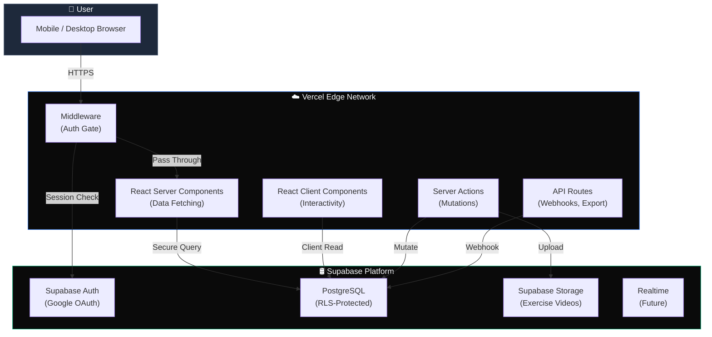
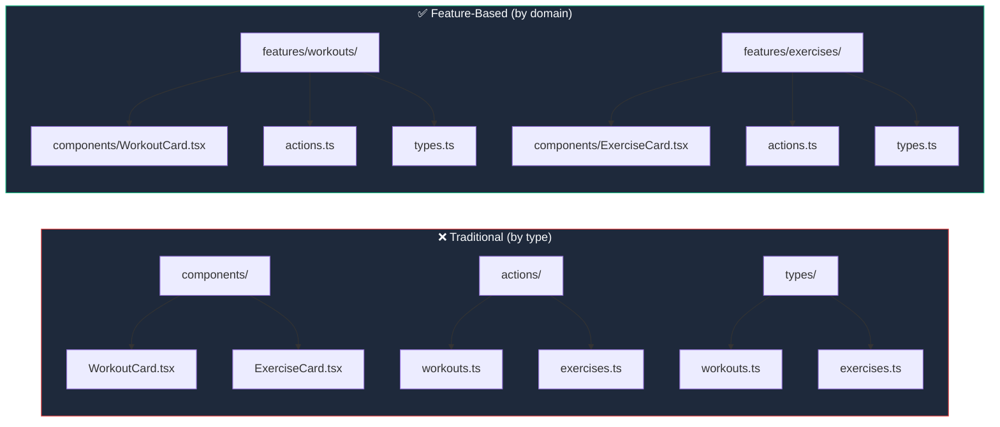
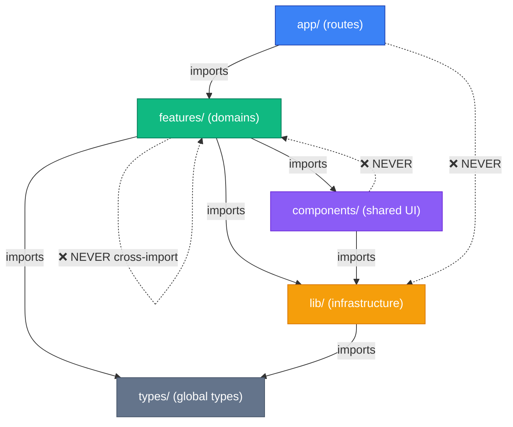
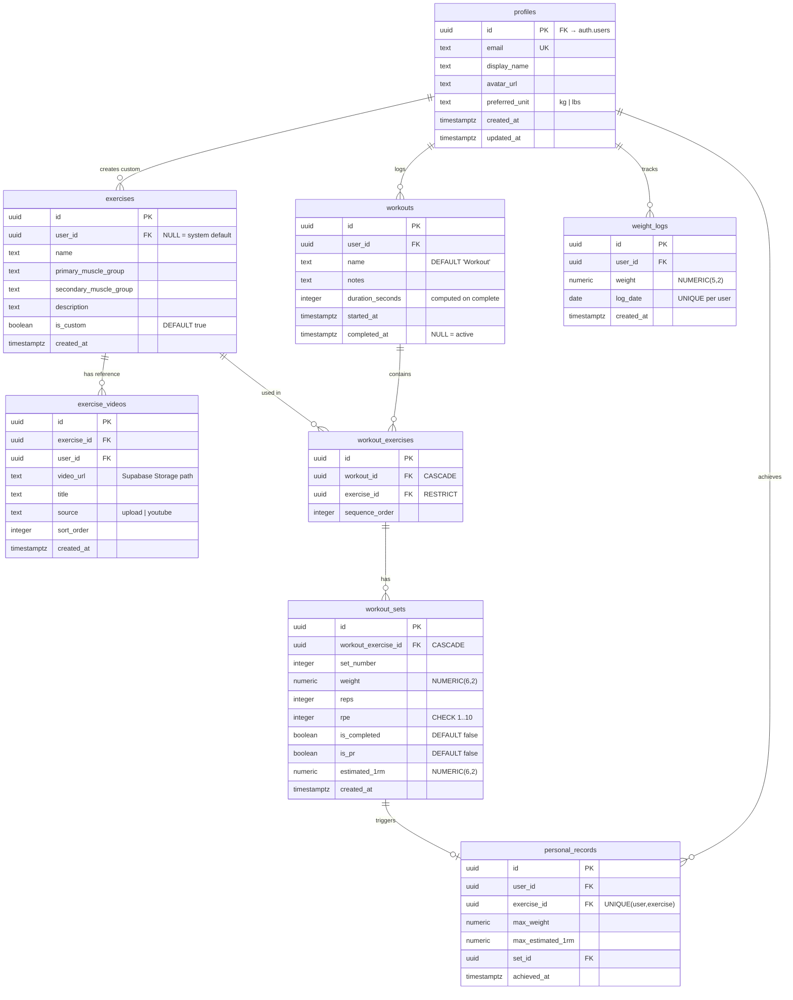
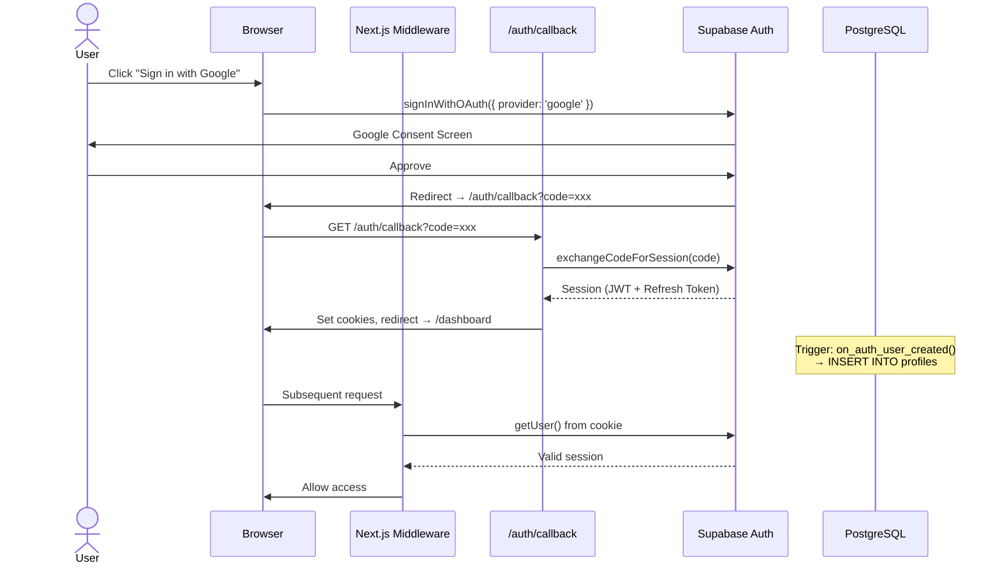
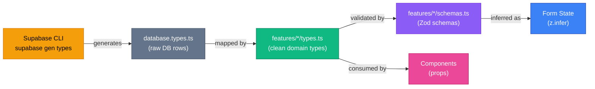
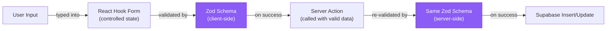
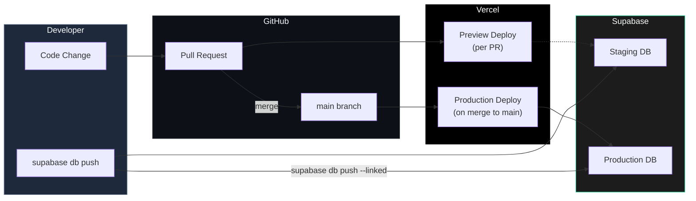
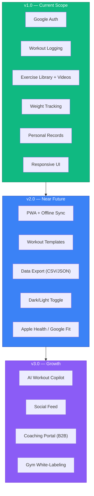

# THE TRACKER — Complete Architecture Document

> **Track. Improve. Repeat.**

*Principal Software Architect Reference — v1.0*

---

## Table of Contents

1. [High-Level Architecture](#1-high-level-architecture)
2. [Feature-Based Folder Structure](#2-feature-based-folder-structure)
3. [Domain-Driven Module Structure](#3-domain-driven-module-structure)
4. [Database Design](#4-database-design)
5. [Authentication Architecture](#5-authentication-architecture)
6. [Route Structure](#6-route-structure)
7. [TypeScript Strategy](#7-typescript-strategy)
8. [State Management Strategy](#8-state-management-strategy)
9. [Server Actions Strategy](#9-server-actions-strategy)
10. [Component Architecture](#10-component-architecture)
11. [Form Validation Architecture](#11-form-validation-architecture)
12. [Error Handling Strategy](#12-error-handling-strategy)
13. [Logging Strategy](#13-logging-strategy)
14. [Security Considerations](#14-security-considerations)
15. [Deployment Architecture](#15-deployment-architecture)
16. [Future Expansion Strategy](#16-future-expansion-strategy)

---

## 1. High-Level Architecture

THE TRACKER follows a **Serverless-First, Edge-Optimized** architecture built on three clearly separated tiers.

### System Context Diagram



### Architectural Principles Applied

| Principle | Implementation |
|:---|:---|
| **Simplicity First** | No Redux, no GraphQL, no microservices. Supabase + Server Actions + React state. |
| **Clean Code** | Feature-based modules, single-responsibility files, explicit naming. |
| **Maintainability** | Colocated tests, colocated types, colocated actions per feature. |
| **Scalability Without Overengineering** | Supabase scales vertically, Vercel scales horizontally at the edge. No Kubernetes. |
| **Feature-Based Organization** | Each domain owns its routes, components, actions, types, and validation schemas. |
| **Type Safety** | Auto-generated DB types → domain types → Zod schemas → form state. End-to-end. |
| **Developer Experience** | One command to start (`npm run dev`), hot reload, typed everything. |

### Request Lifecycle

```
Browser Request
    │
    ▼
┌──────────────────────────────┐
│  Next.js Middleware          │  ← Reads Supabase session cookie
│  (middleware.ts)             │  ← Redirects unauthenticated users
└──────────────────────────────┘
    │
    ▼
┌──────────────────────────────┐
│  Route Handler               │
│  ┌────────────────────────┐  │
│  │ layout.tsx              │  │  ← Wraps with providers, nav shell
│  │  └─ page.tsx            │  │  ← Server Component: fetches data
│  │      └─ <ClientForm />  │  │  ← Client Component: interactivity
│  └────────────────────────┘  │
└──────────────────────────────┘
    │                    │
    ▼                    ▼
Server Action        Direct Read
(mutation)           (supabase.from().select())
    │                    │
    ▼                    ▼
┌──────────────────────────────┐
│  Supabase PostgreSQL         │
│  (RLS enforced at DB layer)  │
└──────────────────────────────┘
```

---

## 2. Feature-Based Folder Structure

Every feature is a self-contained module. A developer working on "exercises" never needs to touch "workouts" code.

```
the-tracker/
│
├── src/
│   ├── app/                              # Next.js 15 App Router
│   │   ├── (auth)/                       # Route group: public auth pages
│   │   │   ├── login/page.tsx
│   │   │   └── auth/callback/route.ts
│   │   │
│   │   ├── (dashboard)/                  # Route group: protected pages
│   │   │   ├── layout.tsx                # Dashboard shell (sidebar + nav)
│   │   │   ├── page.tsx                  # /dashboard — analytics home
│   │   │   ├── workouts/
│   │   │   │   ├── page.tsx              # Workout history list
│   │   │   │   ├── active/page.tsx       # Active workout logger
│   │   │   │   └── [id]/page.tsx         # Workout detail/summary
│   │   │   ├── exercises/
│   │   │   │   ├── page.tsx              # Exercise library
│   │   │   │   └── [id]/page.tsx         # Exercise detail + videos
│   │   │   ├── weight/
│   │   │   │   └── page.tsx              # Body weight tracker
│   │   │   └── records/
│   │   │       └── page.tsx              # Personal records leaderboard
│   │   │
│   │   ├── api/                          # REST endpoints (export, webhooks)
│   │   │   └── export/route.ts
│   │   │
│   │   ├── layout.tsx                    # Root layout (html, body, providers)
│   │   ├── page.tsx                      # Landing page (public)
│   │   ├── globals.css
│   │   ├── not-found.tsx
│   │   └── error.tsx                     # Global error boundary
│   │
│   ├── features/                         # 🧩 FEATURE MODULES (domain logic)
│   │   ├── auth/
│   │   │   ├── actions.ts                # signIn, signOut server actions
│   │   │   ├── components/
│   │   │   │   └── login-button.tsx
│   │   │   └── hooks.ts                  # useAuth, useSession
│   │   │
│   │   ├── workouts/
│   │   │   ├── actions.ts                # startWorkout, completeWorkout, logSet
│   │   │   ├── components/
│   │   │   │   ├── workout-card.tsx
│   │   │   │   ├── set-input-row.tsx
│   │   │   │   ├── rest-timer.tsx
│   │   │   │   └── workout-summary.tsx
│   │   │   ├── hooks.ts                  # useActiveWorkout, useRestTimer
│   │   │   ├── types.ts                  # Workout, WorkoutExercise, WorkoutSet
│   │   │   ├── schemas.ts                # Zod validation schemas
│   │   │   └── queries.ts                # Supabase query builders
│   │   │
│   │   ├── exercises/
│   │   │   ├── actions.ts                # createExercise, uploadVideo
│   │   │   ├── components/
│   │   │   │   ├── exercise-card.tsx
│   │   │   │   ├── exercise-form.tsx
│   │   │   │   ├── muscle-group-filter.tsx
│   │   │   │   └── video-player.tsx
│   │   │   ├── hooks.ts                  # useExerciseSearch
│   │   │   ├── types.ts
│   │   │   ├── schemas.ts
│   │   │   └── queries.ts
│   │   │
│   │   ├── weight/
│   │   │   ├── actions.ts                # logWeight, deleteWeightEntry
│   │   │   ├── components/
│   │   │   │   ├── weight-form.tsx
│   │   │   │   └── weight-chart.tsx
│   │   │   ├── types.ts
│   │   │   ├── schemas.ts
│   │   │   └── queries.ts
│   │   │
│   │   └── records/
│   │       ├── actions.ts                # evaluatePR (called after set completion)
│   │       ├── components/
│   │       │   ├── pr-badge.tsx
│   │       │   └── records-table.tsx
│   │       ├── types.ts
│   │       ├── utils.ts                  # calculate1RM (Epley formula)
│   │       └── queries.ts
│   │
│   ├── components/                       # 🎨 SHARED UI (design system)
│   │   ├── ui/                           # shadcn/ui primitives
│   │   │   ├── button.tsx
│   │   │   ├── input.tsx
│   │   │   ├── dialog.tsx
│   │   │   ├── card.tsx
│   │   │   ├── select.tsx
│   │   │   ├── toast.tsx
│   │   │   ├── skeleton.tsx
│   │   │   └── ...
│   │   ├── layout/
│   │   │   ├── sidebar.tsx
│   │   │   ├── bottom-nav.tsx
│   │   │   └── page-header.tsx
│   │   └── shared/
│   │       ├── loading-spinner.tsx
│   │       ├── empty-state.tsx
│   │       └── confirm-dialog.tsx
│   │
│   ├── lib/                              # 🔧 INFRASTRUCTURE
│   │   ├── supabase/
│   │   │   ├── client.ts                 # Browser client
│   │   │   ├── server.ts                 # Server client (cookies)
│   │   │   └── admin.ts                  # Service role client (triggers)
│   │   ├── utils.ts                      # cn(), formatDate(), etc.
│   │   └── constants.ts                  # MUSCLE_GROUPS, RPE_SCALE, etc.
│   │
│   ├── types/                            # 🏷️ GLOBAL TYPES
│   │   ├── database.types.ts             # Auto-generated by Supabase CLI
│   │   └── index.ts                      # Re-exports + utility types
│   │
│   └── middleware.ts                     # Auth gate
│
├── supabase/
│   ├── migrations/
│   │   ├── 00001_profiles.sql
│   │   ├── 00002_exercises.sql
│   │   ├── 00003_workouts.sql
│   │   ├── 00004_weight_logs.sql
│   │   ├── 00005_personal_records.sql
│   │   ├── 00006_exercise_videos.sql
│   │   └── 00007_rls_policies.sql
│   ├── seed.sql
│   └── config.toml
│
├── public/
│   └── icons/
├── tailwind.config.ts
├── next.config.ts
├── tsconfig.json
├── components.json                       # shadcn/ui config
└── package.json
```

### Why Feature-Based?



> **Rule**: If you need to touch 3+ directories to add one feature, your architecture is wrong.

---

## 3. Domain-Driven Module Structure

Each feature module follows a consistent internal contract:

```
features/<domain>/
├── actions.ts          # Server Actions (mutations)
├── queries.ts          # Supabase read queries (reusable)
├── types.ts            # Domain-specific TypeScript types
├── schemas.ts          # Zod validation schemas
├── hooks.ts            # Client-side React hooks
├── utils.ts            # Pure helper functions (calculations, formatters)
└── components/         # UI components scoped to this domain
    ├── <domain>-card.tsx
    ├── <domain>-form.tsx
    └── ...
```

### Module Dependency Rules



**Key Rule**: Feature modules NEVER import from each other directly. If two features need shared logic, it moves to `lib/` or a new shared feature is extracted.

### Example: The `workouts` Module

```typescript
// features/workouts/types.ts
export interface Workout {
  id: string;
  userId: string;
  name: string;
  notes: string | null;
  startedAt: string;
  completedAt: string | null;
}

export interface WorkoutExercise {
  id: string;
  workoutId: string;
  exerciseId: string;
  sequenceOrder: number;
  exercise: {
    id: string;
    name: string;
    primaryMuscleGroup: string;
  };
  sets: WorkoutSet[];
}

export interface WorkoutSet {
  id: string;
  workoutExerciseId: string;
  setNumber: number;
  weight: number;
  reps: number;
  rpe: number | null;
  isCompleted: boolean;
  isPr: boolean;
  estimated1rm: number | null;
}
```

```typescript
// features/workouts/queries.ts
import { createClient } from '@/lib/supabase/server';

export async function getWorkoutHistory(userId: string, limit = 20) {
  const supabase = await createClient();
  
  return supabase
    .from('workouts')
    .select(`
      *,
      workout_exercises (
        *,
        exercise:exercises ( id, name, primary_muscle_group ),
        sets:workout_sets ( * )
      )
    `)
    .eq('user_id', userId)
    .not('completed_at', 'is', null)
    .order('completed_at', { ascending: false })
    .limit(limit);
}

export async function getActiveWorkout(userId: string) {
  const supabase = await createClient();

  return supabase
    .from('workouts')
    .select(`
      *,
      workout_exercises (
        *,
        exercise:exercises ( id, name, primary_muscle_group ),
        sets:workout_sets ( * )
      )
    `)
    .eq('user_id', userId)
    .is('completed_at', null)
    .single();
}
```

---

## 4. Database Design

### Entity-Relationship Diagram



### New Table: `exercise_videos`

```sql
CREATE TABLE public.exercise_videos (
    id UUID DEFAULT gen_random_uuid() PRIMARY KEY,
    exercise_id UUID REFERENCES public.exercises(id) ON DELETE CASCADE NOT NULL,
    user_id UUID REFERENCES public.profiles(id) ON DELETE CASCADE NOT NULL,
    video_url TEXT NOT NULL,
    title TEXT,
    source TEXT DEFAULT 'upload' CHECK (source IN ('upload', 'youtube')),
    sort_order INTEGER DEFAULT 0,
    created_at TIMESTAMPTZ DEFAULT NOW() NOT NULL
);

-- RLS: Users see their own videos + videos for system exercises
CREATE POLICY "Users can view relevant exercise videos"
    ON public.exercise_videos FOR SELECT
    USING (
        user_id = auth.uid()
        OR exercise_id IN (
            SELECT id FROM public.exercises WHERE user_id IS NULL
        )
    );

CREATE POLICY "Users manage own videos"
    ON public.exercise_videos FOR ALL
    USING (auth.uid() = user_id)
    WITH CHECK (auth.uid() = user_id);
```

### Index Strategy

```sql
-- Hot query paths
CREATE INDEX idx_workouts_user_active ON workouts(user_id) WHERE completed_at IS NULL;
CREATE INDEX idx_workouts_user_completed ON workouts(user_id, completed_at DESC);
CREATE INDEX idx_workout_sets_exercise ON workout_sets(workout_exercise_id);
CREATE INDEX idx_weight_logs_user_date ON weight_logs(user_id, log_date DESC);
CREATE INDEX idx_exercises_muscle ON exercises(primary_muscle_group);
CREATE INDEX idx_exercise_videos_exercise ON exercise_videos(exercise_id);
CREATE INDEX idx_personal_records_user ON personal_records(user_id, exercise_id);
```

---

## 5. Authentication Architecture

### Flow: Google OAuth via Supabase



### Middleware Implementation

```typescript
// src/middleware.ts
import { createServerClient } from '@supabase/ssr';
import { type NextRequest, NextResponse } from 'next/server';

const PUBLIC_ROUTES = ['/', '/login', '/auth/callback'];

export async function middleware(request: NextRequest) {
  let response = NextResponse.next({ request });

  const supabase = createServerClient(
    process.env.NEXT_PUBLIC_SUPABASE_URL!,
    process.env.NEXT_PUBLIC_SUPABASE_ANON_KEY!,
    {
      cookies: {
        getAll: () => request.cookies.getAll(),
        setAll: (cookies) => {
          cookies.forEach(({ name, value, options }) => {
            request.cookies.set(name, value);
            response.cookies.set(name, value, options);
          });
        },
      },
    }
  );

  const { data: { user } } = await supabase.auth.getUser();
  const isPublic = PUBLIC_ROUTES.some(r => request.nextUrl.pathname === r);

  if (!user && !isPublic) {
    return NextResponse.redirect(new URL('/login', request.url));
  }

  if (user && request.nextUrl.pathname === '/login') {
    return NextResponse.redirect(new URL('/dashboard', request.url));
  }

  return response;
}

export const config = {
  matcher: ['/((?!_next/static|_next/image|favicon.ico|icons).*)'],
};
```

### Auth Callback Route

```typescript
// src/app/(auth)/auth/callback/route.ts
import { createClient } from '@/lib/supabase/server';
import { NextRequest, NextResponse } from 'next/server';

export async function GET(request: NextRequest) {
  const { searchParams, origin } = request.nextUrl;
  const code = searchParams.get('code');
  const next = searchParams.get('next') ?? '/dashboard';

  if (code) {
    const supabase = await createClient();
    const { error } = await supabase.auth.exchangeCodeForSession(code);

    if (!error) {
      return NextResponse.redirect(`${origin}${next}`);
    }
  }

  return NextResponse.redirect(`${origin}/login?error=auth_failed`);
}
```

---

## 6. Route Structure

### Route Map

```
/                          → Public landing page (Server Component)
/login                     → Google OAuth trigger page

/dashboard                 → Analytics overview (protected)
/dashboard/workouts        → Workout history list
/dashboard/workouts/active → Active workout logger (heavy client interactivity)
/dashboard/workouts/[id]   → Completed workout summary
/dashboard/exercises       → Exercise library (search + filter)
/dashboard/exercises/[id]  → Exercise detail + video references
/dashboard/weight          → Body weight log + chart
/dashboard/records         → Personal records table

/api/export                → Data export endpoint (JSON/CSV)

/auth/callback             → OAuth code exchange
```

### Route Groups

```
(auth)/        → Public authentication routes. No sidebar, no nav.
(dashboard)/   → Protected routes. Shared layout with sidebar + bottom nav.
```

### Rendering Strategy Per Route

| Route | Rendering | Reason |
|:---|:---|:---|
| `/` | Static (SSG) | Marketing page, no user data |
| `/login` | Static (SSG) | Single button, no dynamic content |
| `/dashboard` | Server (SSR) | Needs fresh analytics per request |
| `/dashboard/workouts` | Server (SSR) | Workout history is user-specific |
| `/dashboard/workouts/active` | Client-heavy | Real-time set logging, timers, localStorage backup |
| `/dashboard/exercises` | Server (SSR) | Initial data fetch, client search overlay |
| `/dashboard/exercises/[id]` | Server (SSR) | Exercise detail + preloaded video list |
| `/dashboard/weight` | Server (SSR) | Chart data fetched server-side |
| `/dashboard/records` | Server (SSR) | PR table fetched server-side |

---

## 7. TypeScript Strategy

### Type Flow: Database → Domain → UI



### Auto-Generated DB Types (Never Edit)

```bash
npx supabase gen types typescript --local > src/types/database.types.ts
```

### Domain Type Mapping

```typescript
// src/features/exercises/types.ts
import type { Database } from '@/types/database.types';

// Raw DB row type
type ExerciseRow = Database['public']['Tables']['exercises']['Row'];
type ExerciseVideoRow = Database['public']['Tables']['exercise_videos']['Row'];

// Clean domain type (camelCase, enriched)
export interface Exercise {
  id: string;
  userId: string | null;
  name: string;
  primaryMuscleGroup: MuscleGroup;
  secondaryMuscleGroup: MuscleGroup | null;
  description: string | null;
  isCustom: boolean;
  createdAt: string;
  videos?: ExerciseVideo[];
}

export interface ExerciseVideo {
  id: string;
  exerciseId: string;
  videoUrl: string;
  title: string | null;
  source: 'upload' | 'youtube';
  sortOrder: number;
}

export type MuscleGroup =
  | 'chest' | 'back' | 'legs' | 'shoulders'
  | 'arms' | 'core' | 'cardio';

// Mapper: DB row → domain type
export function toExercise(row: ExerciseRow): Exercise {
  return {
    id: row.id,
    userId: row.user_id,
    name: row.name,
    primaryMuscleGroup: row.primary_muscle_group as MuscleGroup,
    secondaryMuscleGroup: row.secondary_muscle_group as MuscleGroup | null,
    description: row.description,
    isCustom: row.is_custom,
    createdAt: row.created_at,
  };
}
```

### Strict TSConfig

```json
{
  "compilerOptions": {
    "strict": true,
    "noUncheckedIndexedAccess": true,
    "exactOptionalPropertyTypes": false,
    "noImplicitReturns": true,
    "noFallthroughCasesInSwitch": true,
    "forceConsistentCasingInFileNames": true
  }
}
```

---

## 8. State Management Strategy

### Decision: No Global State Library

```
┌──────────────────────────────────────────────────────────┐
│                    State Hierarchy                        │
├──────────────────────────────────────────────────────────┤
│                                                          │
│  Server State (95%)    ──→  React Server Components      │
│    Workout history           fetched via Supabase         │
│    Exercise library          queries in page.tsx          │
│    Weight logs                                           │
│    Personal records                                      │
│                                                          │
│  Form State (3%)       ──→  React Hook Form + Zod        │
│    Weight input              controlled per-form          │
│    Exercise creation                                     │
│    Set logging inputs                                    │
│                                                          │
│  Ephemeral UI State (2%) → useState / useReducer         │
│    Rest timer countdown      local to component          │
│    Modal open/close                                      │
│    Active workout draft      + localStorage backup       │
│                                                          │
└──────────────────────────────────────────────────────────┘
```

### Active Workout: The One Complex State

The active workout page is the **only** component requiring sophisticated client state. We use `useReducer` + `localStorage` persistence:

```typescript
// features/workouts/hooks.ts
'use client';

import { useReducer, useEffect } from 'react';

interface WorkoutState {
  workoutId: string | null;
  exercises: ActiveExercise[];
  startedAt: string;
}

type WorkoutAction =
  | { type: 'ADD_EXERCISE'; exercise: ActiveExercise }
  | { type: 'LOG_SET'; exerciseIndex: number; set: SetInput }
  | { type: 'COMPLETE_SET'; exerciseIndex: number; setIndex: number }
  | { type: 'REMOVE_EXERCISE'; exerciseIndex: number }
  | { type: 'RESTORE'; state: WorkoutState }
  | { type: 'RESET' };

function workoutReducer(state: WorkoutState, action: WorkoutAction): WorkoutState {
  switch (action.type) {
    case 'ADD_EXERCISE':
      return { ...state, exercises: [...state.exercises, action.exercise] };
    case 'LOG_SET':
      // immutable update of specific set in specific exercise
      return { ...state, exercises: state.exercises.map((ex, i) =>
        i === action.exerciseIndex
          ? { ...ex, sets: [...ex.sets, action.set] }
          : ex
      )};
    case 'COMPLETE_SET':
      return { ...state, exercises: state.exercises.map((ex, ei) =>
        ei === action.exerciseIndex
          ? { ...ex, sets: ex.sets.map((s, si) =>
              si === action.setIndex ? { ...s, isCompleted: true } : s
            )}
          : ex
      )};
    case 'RESTORE':
      return action.state;
    case 'RESET':
      return { workoutId: null, exercises: [], startedAt: '' };
    default:
      return state;
  }
}

const STORAGE_KEY = 'active-workout-draft';

export function useActiveWorkout() {
  const [state, dispatch] = useReducer(workoutReducer, {
    workoutId: null,
    exercises: [],
    startedAt: new Date().toISOString(),
  });

  // Restore from localStorage on mount
  useEffect(() => {
    const saved = localStorage.getItem(STORAGE_KEY);
    if (saved) {
      dispatch({ type: 'RESTORE', state: JSON.parse(saved) });
    }
  }, []);

  // Persist every change
  useEffect(() => {
    if (state.workoutId) {
      localStorage.setItem(STORAGE_KEY, JSON.stringify(state));
    }
  }, [state]);

  const clearDraft = () => {
    localStorage.removeItem(STORAGE_KEY);
    dispatch({ type: 'RESET' });
  };

  return { state, dispatch, clearDraft };
}
```

---

## 9. Server Actions Strategy

### Pattern: Every Action Returns `ActionResult<T>`

```typescript
// lib/utils.ts (action result type)
export type ActionResult<T = void> =
  | { success: true; data: T }
  | { success: false; error: string };
```

### Example: Complete Workout Action

```typescript
// features/workouts/actions.ts
'use server';

import { revalidatePath } from 'next/cache';
import { createClient } from '@/lib/supabase/server';
import { workoutSchema } from './schemas';
import type { ActionResult } from '@/lib/utils';

export async function completeWorkout(
  workoutId: string,
  notes?: string
): Promise<ActionResult<{ id: string }>> {
  try {
    const supabase = await createClient();
    const { data: { user } } = await supabase.auth.getUser();

    if (!user) {
      return { success: false, error: 'Unauthorized' };
    }

    const { data, error } = await supabase
      .from('workouts')
      .update({
        completed_at: new Date().toISOString(),
        notes: notes ?? null,
      })
      .eq('id', workoutId)
      .eq('user_id', user.id)  // RLS double-check
      .select('id')
      .single();

    if (error) {
      return { success: false, error: error.message };
    }

    revalidatePath('/dashboard');
    revalidatePath('/dashboard/workouts');
    revalidatePath('/dashboard/records');

    return { success: true, data: { id: data.id } };
  } catch (err) {
    return { success: false, error: 'An unexpected error occurred' };
  }
}
```

### Example: Upload Exercise Video

```typescript
// features/exercises/actions.ts
'use server';

import { createClient } from '@/lib/supabase/server';
import type { ActionResult } from '@/lib/utils';

export async function uploadExerciseVideo(
  exerciseId: string,
  formData: FormData
): Promise<ActionResult<{ videoUrl: string }>> {
  try {
    const supabase = await createClient();
    const { data: { user } } = await supabase.auth.getUser();

    if (!user) return { success: false, error: 'Unauthorized' };

    const file = formData.get('video') as File;
    if (!file) return { success: false, error: 'No file provided' };

    // Validate file type and size (max 50MB)
    const ALLOWED_TYPES = ['video/mp4', 'video/webm', 'video/quicktime'];
    if (!ALLOWED_TYPES.includes(file.type)) {
      return { success: false, error: 'Invalid file type. Use MP4, WebM, or MOV.' };
    }
    if (file.size > 50 * 1024 * 1024) {
      return { success: false, error: 'File too large. Maximum 50MB.' };
    }

    const fileName = `${user.id}/${exerciseId}/${Date.now()}-${file.name}`;

    const { error: uploadError } = await supabase.storage
      .from('exercise-videos')
      .upload(fileName, file);

    if (uploadError) {
      return { success: false, error: uploadError.message };
    }

    const { data: urlData } = supabase.storage
      .from('exercise-videos')
      .getPublicUrl(fileName);

    const { error: dbError } = await supabase
      .from('exercise_videos')
      .insert({
        exercise_id: exerciseId,
        user_id: user.id,
        video_url: urlData.publicUrl,
        source: 'upload',
      });

    if (dbError) {
      return { success: false, error: dbError.message };
    }

    return { success: true, data: { videoUrl: urlData.publicUrl } };
  } catch {
    return { success: false, error: 'Upload failed' };
  }
}
```

### Server Action Rules

1. **Always** return `ActionResult<T>` — never throw from actions
2. **Always** verify `auth.getUser()` at the top
3. **Always** validate input with Zod before DB writes
4. **Always** call `revalidatePath()` for affected routes
5. **Never** return raw Supabase errors to the client

---

## 10. Component Architecture

### Component Classification

```
┌─────────────────────────────────────────────────────────────────┐
│                                                                 │
│  Server Components (default)                                    │
│  ┌──────────────────────────────────────────────────────────┐  │
│  │  • Page-level data fetching (page.tsx)                    │  │
│  │  • Layout shells (layout.tsx)                             │  │
│  │  • Static content blocks                                  │  │
│  │  • Exercise library list (read-only render)               │  │
│  └──────────────────────────────────────────────────────────┘  │
│                           │ passes data as props               │
│                           ▼                                    │
│  Client Components ("use client")                              │
│  ┌──────────────────────────────────────────────────────────┐  │
│  │  • Forms (weight-form.tsx, exercise-form.tsx)              │  │
│  │  • Interactive inputs (set-input-row.tsx)                  │  │
│  │  • Timers (rest-timer.tsx)                                │  │
│  │  • Charts (weight-chart.tsx)                               │  │
│  │  • Modals and drawers                                     │  │
│  │  • Video player (video-player.tsx)                         │  │
│  └──────────────────────────────────────────────────────────┘  │
│                                                                 │
└─────────────────────────────────────────────────────────────────┘
```

### Composition Pattern Example

```typescript
// app/(dashboard)/exercises/[id]/page.tsx  (Server Component)
import { getExerciseById } from '@/features/exercises/queries';
import { VideoPlayer } from '@/features/exercises/components/video-player';
import { VideoUploadForm } from '@/features/exercises/components/video-upload-form';
import { PageHeader } from '@/components/layout/page-header';
import { notFound } from 'next/navigation';

export default async function ExerciseDetailPage({
  params,
}: {
  params: Promise<{ id: string }>;
}) {
  const { id } = await params;
  const { data: exercise, error } = await getExerciseById(id);

  if (error || !exercise) notFound();

  return (
    <div className="space-y-8">
      <PageHeader
        title={exercise.name}
        description={exercise.primary_muscle_group}
      />

      {/* Video references section */}
      <section>
        <h2 className="text-lg font-semibold mb-4">Reference Videos</h2>
        <div className="grid gap-4 sm:grid-cols-2">
          {exercise.exercise_videos?.map((video) => (
            <VideoPlayer key={video.id} video={video} />
          ))}
        </div>
        <VideoUploadForm exerciseId={id} />
      </section>
    </div>
  );
}
```

---

## 11. Form Validation Architecture

### Stack: Zod + React Hook Form + Server Action



### Schema Definition

```typescript
// features/weight/schemas.ts
import { z } from 'zod';

export const weightLogSchema = z.object({
  weight: z
    .number({ required_error: 'Weight is required' })
    .positive('Weight must be positive')
    .max(500, 'Please enter a realistic weight'),
  logDate: z
    .string()
    .regex(/^\d{4}-\d{2}-\d{2}$/, 'Use YYYY-MM-DD format'),
  unit: z.enum(['kg', 'lbs']).default('kg'),
});

export type WeightLogInput = z.infer<typeof weightLogSchema>;
```

### Client Form Component

```typescript
// features/weight/components/weight-form.tsx
'use client';

import { useForm } from 'react-hook-form';
import { zodResolver } from '@hookform/resolvers/zod';
import { weightLogSchema, type WeightLogInput } from '../schemas';
import { logWeight } from '../actions';
import { Button } from '@/components/ui/button';
import { Input } from '@/components/ui/input';
import { toast } from 'sonner';

export function WeightForm() {
  const form = useForm<WeightLogInput>({
    resolver: zodResolver(weightLogSchema),
    defaultValues: {
      weight: undefined,
      logDate: new Date().toISOString().split('T')[0],
      unit: 'kg',
    },
  });

  async function onSubmit(values: WeightLogInput) {
    const result = await logWeight(values);

    if (result.success) {
      toast.success('Weight logged');
      form.reset();
    } else {
      toast.error(result.error);
    }
  }

  return (
    <form onSubmit={form.handleSubmit(onSubmit)} className="space-y-4">
      <div>
        <Input
          type="number"
          step="0.1"
          inputMode="decimal"
          placeholder="0.0"
          {...form.register('weight', { valueAsNumber: true })}
          className="text-center font-mono text-lg"
        />
        {form.formState.errors.weight && (
          <p className="text-sm text-red-400 mt-1">
            {form.formState.errors.weight.message}
          </p>
        )}
      </div>

      <Button
        type="submit"
        className="w-full"
        disabled={form.formState.isSubmitting}
      >
        {form.formState.isSubmitting ? 'Saving...' : 'Log Weight'}
      </Button>
    </form>
  );
}
```

### Server-Side Re-Validation

```typescript
// features/weight/actions.ts
'use server';

import { weightLogSchema, type WeightLogInput } from './schemas';
import { createClient } from '@/lib/supabase/server';
import type { ActionResult } from '@/lib/utils';
import { revalidatePath } from 'next/cache';

export async function logWeight(input: WeightLogInput): Promise<ActionResult> {
  // Re-validate on server (never trust client)
  const parsed = weightLogSchema.safeParse(input);
  if (!parsed.success) {
    return { success: false, error: parsed.error.errors[0]?.message ?? 'Invalid input' };
  }

  const supabase = await createClient();
  const { data: { user } } = await supabase.auth.getUser();
  if (!user) return { success: false, error: 'Unauthorized' };

  const { error } = await supabase
    .from('weight_logs')
    .upsert(
      {
        user_id: user.id,
        weight: parsed.data.weight,
        log_date: parsed.data.logDate,
      },
      { onConflict: 'user_id,log_date' }
    );

  if (error) return { success: false, error: 'Failed to log weight' };

  revalidatePath('/dashboard/weight');
  revalidatePath('/dashboard');
  return { success: true, data: undefined };
}
```

---

## 12. Error Handling Strategy

### Error Boundary Hierarchy

```
Root Error Boundary (app/error.tsx)
  └── Dashboard Error Boundary (app/(dashboard)/error.tsx)
       └── Page-level try/catch (in Server Components)
            └── Action-level ActionResult (in Server Actions)
                 └── Form-level error display (in Client Components)
```

### Global Error Boundary

```typescript
// src/app/error.tsx
'use client';

import { useEffect } from 'react';
import { Button } from '@/components/ui/button';

export default function GlobalError({
  error,
  reset,
}: {
  error: Error & { digest?: string };
  reset: () => void;
}) {
  useEffect(() => {
    // Log to external service in production
    console.error('[GlobalError]', error.message, error.digest);
  }, [error]);

  return (
    <div className="flex min-h-screen items-center justify-center">
      <div className="text-center space-y-4">
        <h1 className="text-2xl font-bold">Something went wrong</h1>
        <p className="text-muted-foreground">
          An unexpected error occurred. Please try again.
        </p>
        <Button onClick={reset}>Try Again</Button>
      </div>
    </div>
  );
}
```

### Error Classification

| Error Type | Handling | User Experience |
|:---|:---|:---|
| **Auth expired** | Middleware redirects to `/login` | Transparent re-login |
| **RLS violation** | Action returns `{ success: false }` | Toast: "Unauthorized" |
| **Validation error** | Zod parse failure | Inline field errors |
| **Network error** | Caught in action try/catch | Toast: "Connection issue" |
| **Not found** | `notFound()` in Server Component | Custom 404 page |
| **Server crash** | `error.tsx` boundary | "Something went wrong" + retry |

---

## 13. Logging Strategy

### Structured Log Levels

```typescript
// lib/logger.ts
type LogLevel = 'debug' | 'info' | 'warn' | 'error';

interface LogEntry {
  level: LogLevel;
  message: string;
  context?: Record<string, unknown>;
  timestamp: string;
}

function log(level: LogLevel, message: string, context?: Record<string, unknown>) {
  const entry: LogEntry = {
    level,
    message,
    context,
    timestamp: new Date().toISOString(),
  };

  if (process.env.NODE_ENV === 'development') {
    const color = { debug: '🔵', info: '🟢', warn: '🟡', error: '🔴' }[level];
    console.log(`${color} [${level.toUpperCase()}] ${message}`, context ?? '');
  } else {
    // Production: structured JSON for Vercel log drain
    console.log(JSON.stringify(entry));
  }
}

export const logger = {
  debug: (msg: string, ctx?: Record<string, unknown>) => log('debug', msg, ctx),
  info: (msg: string, ctx?: Record<string, unknown>) => log('info', msg, ctx),
  warn: (msg: string, ctx?: Record<string, unknown>) => log('warn', msg, ctx),
  error: (msg: string, ctx?: Record<string, unknown>) => log('error', msg, ctx),
};
```

### What To Log

| Event | Level | Context |
|:---|:---|:---|
| User signs in | `info` | `{ userId }` |
| Workout completed | `info` | `{ workoutId, exerciseCount, duration }` |
| PR achieved | `info` | `{ userId, exerciseId, weight, estimated1rm }` |
| Action validation failure | `warn` | `{ action, errors }` |
| Supabase query error | `error` | `{ table, operation, message }` |
| Unhandled exception | `error` | `{ message, stack, digest }` |

---

## 14. Security Considerations

### Defense-in-Depth Layers

```
Layer 1: Network         → HTTPS everywhere (Vercel + Supabase enforce TLS)
Layer 2: Authentication  → Supabase Auth (JWT, refresh tokens, PKCE)
Layer 3: Authorization   → PostgreSQL RLS (auth.uid() = user_id)
Layer 4: Input           → Zod validation on client AND server
Layer 5: Query           → Supabase SDK parameterized queries (no raw SQL)
Layer 6: Cookies         → HttpOnly, Secure, SameSite=Lax
Layer 7: Headers         → CSP, X-Frame-Options, X-Content-Type-Options
```

### RLS Policies (Summary)

```sql
-- Pattern applied to ALL user-owned tables:
CREATE POLICY "user_isolation"
  ON public.<table>
  FOR ALL
  USING (auth.uid() = user_id)
  WITH CHECK (auth.uid() = user_id);

-- Exercises: system defaults visible to all
CREATE POLICY "exercises_read"
  ON public.exercises
  FOR SELECT
  USING (user_id IS NULL OR auth.uid() = user_id);
```

### Environment Variable Security

```
NEXT_PUBLIC_*          → Safe for browser. Only Supabase URL + anon key.
SUPABASE_SERVICE_ROLE  → Server-only. Never exposed to client.
                         Used only in admin triggers, never in actions.
```

### Content Security Policy

```typescript
// next.config.ts
const securityHeaders = [
  {
    key: 'Content-Security-Policy',
    value: [
      "default-src 'self'",
      "script-src 'self' 'unsafe-eval' 'unsafe-inline'",  // Next.js requires
      "style-src 'self' 'unsafe-inline'",
      "img-src 'self' data: https://*.supabase.co",
      "media-src 'self' https://*.supabase.co",             // Exercise videos
      "connect-src 'self' https://*.supabase.co wss://*.supabase.co",
      "frame-src 'self' https://www.youtube.com",           // YouTube embeds
    ].join('; '),
  },
  { key: 'X-Frame-Options', value: 'DENY' },
  { key: 'X-Content-Type-Options', value: 'nosniff' },
  { key: 'Referrer-Policy', value: 'strict-origin-when-cross-origin' },
];
```

---

## 15. Deployment Architecture

### Pipeline: Git → Vercel → Production



### Environment Matrix

| Environment | Vercel | Supabase | Branch |
|:---|:---|:---|:---|
| **Local** | `npm run dev` | `supabase start` (Docker) | any |
| **Preview** | Auto per PR | Staging project | feature/* |
| **Production** | Auto on merge | Production project | main |

### Vercel Configuration

```json
// vercel.json (if needed)
{
  "framework": "nextjs",
  "buildCommand": "npm run build",
  "installCommand": "npm ci",
  "regions": ["iad1"],
  "env": {
    "NEXT_PUBLIC_SUPABASE_URL": "@supabase-url",
    "NEXT_PUBLIC_SUPABASE_ANON_KEY": "@supabase-anon-key"
  }
}
```

### Database Migration Workflow

```bash
# 1. Create migration locally
npx supabase migration new add_exercise_videos

# 2. Write SQL in supabase/migrations/<timestamp>_add_exercise_videos.sql

# 3. Apply locally
npx supabase db reset

# 4. Test locally
npm run dev

# 5. Push to production
npx supabase db push --linked

# 6. Regenerate types
npx supabase gen types typescript --linked > src/types/database.types.ts
```

---

## 16. Future Expansion Strategy

### Expansion Readiness Map



### How the Architecture Supports Expansion

| Future Feature | Architectural Support |
|:---|:---|
| **PWA / Offline** | `useReducer` state in workouts is already serializable. Add Service Worker + IndexedDB sync layer without rewriting state logic. |
| **Workout Templates** | New `features/templates/` module. New `workout_templates` + `template_exercises` tables. Zero changes to existing features. |
| **AI Copilot** | New `features/ai/` module. Supabase Edge Function calls LLM API. Returns suggestions via a new Server Action. |
| **Social Feed** | New `features/social/` module. New `shared_workouts` table with separate RLS (public visibility). Existing workout data untouched. |
| **Coaching Portal** | New `features/coaching/` module. New `coach_clients` junction table. Coaches get RLS policies to view client data. Multi-tenancy ready because RLS is user-scoped from day one. |
| **Multiple Auth Providers** | Supabase Auth supports Apple, GitHub, email/password — add to config, no code changes. |
| **Real-time Sync** | Supabase Realtime is already available. Subscribe to `workout_sets` changes for live coaching view. |

### Adding a New Feature: Checklist

```markdown
1. [ ] Create `features/<name>/` directory
2. [ ] Define types in `types.ts`
3. [ ] Write Zod schemas in `schemas.ts`
4. [ ] Write SQL migration in `supabase/migrations/`
5. [ ] Apply migration and regenerate DB types
6. [ ] Build queries in `queries.ts`
7. [ ] Build server actions in `actions.ts`
8. [ ] Build components in `components/`
9. [ ] Create route in `app/(dashboard)/<name>/page.tsx`
10. [ ] Add navigation link in sidebar/bottom-nav
11. [ ] Write tests
12. [ ] Update documentation
```

---

## Appendix: Technology Decision Summary

| Decision | Choice | Rationale |
|:---|:---|:---|
| **Framework** | Next.js 15 App Router | RSC reduces bundle, Server Actions replace API boilerplate, edge rendering for speed |
| **Language** | TypeScript (strict) | Compile-time safety across the entire stack, auto-generated DB types |
| **Styling** | Tailwind CSS + shadcn/ui | Utility-first for speed, shadcn gives accessible Radix primitives without vendor lock |
| **Backend** | Supabase | Auth + DB + Storage + Realtime in one platform, PostgreSQL under the hood |
| **Database** | PostgreSQL | Relational integrity, RLS for security, triggers for automation, battle-tested |
| **Validation** | Zod | Shared schemas between client forms and server actions, TypeScript inference |
| **Forms** | React Hook Form | Minimal re-renders, native integration with Zod resolver |
| **State** | React built-ins | No Redux. `useState` for UI, `useReducer` for workout state, server for everything else |
| **Hosting** | Vercel | Zero-config Next.js deployment, preview deploys, edge network |
| **Auth** | Google OAuth via Supabase | One-click sign in, no password management, enterprise-grade security |
| **Storage** | Supabase Storage | S3-compatible, integrated with RLS, CDN delivery for exercise videos |
