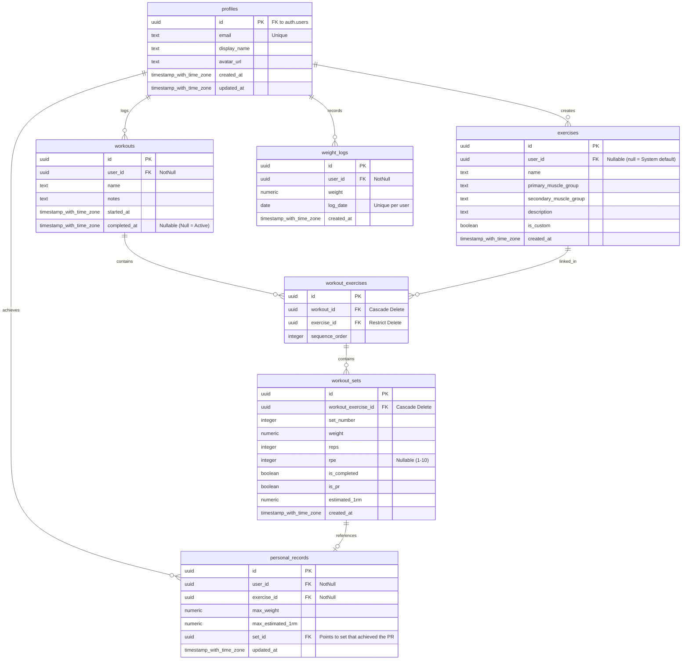

# Database Design

This document details the PostgreSQL schema, indexes, constraints, database triggers, and Row-Level Security (RLS) policies implemented on Supabase for **THE TRACKER**.

---

## 1. Entity-Relationship (ER) Diagram



---

## 2. Table Schemas & SQL DDL

### A. Profiles Table
```sql
CREATE TABLE public.profiles (
    id UUID REFERENCES auth.users(id) ON DELETE CASCADE PRIMARY KEY,
    email TEXT UNIQUE NOT NULL,
    display_name TEXT,
    avatar_url TEXT,
    created_at TIMESTAMP WITH TIME ZONE DEFAULT TIMEZONE('utc'::text, NOW()) NOT NULL,
    updated_at TIMESTAMP WITH TIME ZONE DEFAULT TIMEZONE('utc'::text, NOW()) NOT NULL
);
```

### B. Exercises Table
```sql
CREATE TABLE public.exercises (
    id UUID DEFAULT gen_random_uuid() PRIMARY KEY,
    user_id UUID REFERENCES public.profiles(id) ON DELETE CASCADE, -- NULL means default system exercise
    name TEXT NOT NULL,
    primary_muscle_group TEXT NOT NULL,
    secondary_muscle_group TEXT,
    description TEXT,
    is_custom BOOLEAN DEFAULT TRUE NOT NULL,
    created_at TIMESTAMP WITH TIME ZONE DEFAULT TIMEZONE('utc'::text, NOW()) NOT NULL,
    CONSTRAINT check_muscle_groups CHECK (primary_muscle_group IN ('Chest', 'Back', 'Legs', 'Shoulders', 'Arms', 'Core', 'Cardio'))
);
```

### C. Workouts Table
```sql
CREATE TABLE public.workouts (
    id UUID DEFAULT gen_random_uuid() PRIMARY KEY,
    user_id UUID REFERENCES public.profiles(id) ON DELETE CASCADE NOT NULL,
    name TEXT DEFAULT 'Workout' NOT NULL,
    notes TEXT,
    started_at TIMESTAMP WITH TIME ZONE DEFAULT TIMEZONE('utc'::text, NOW()) NOT NULL,
    completed_at TIMESTAMP WITH TIME ZONE
);
```

### D. Workout Exercises Junction Table
```sql
CREATE TABLE public.workout_exercises (
    id UUID DEFAULT gen_random_uuid() PRIMARY KEY,
    workout_id UUID REFERENCES public.workouts(id) ON DELETE CASCADE NOT NULL,
    exercise_id UUID REFERENCES public.exercises(id) ON DELETE RESTRICT NOT NULL,
    sequence_order INTEGER NOT NULL,
    UNIQUE (workout_id, sequence_order)
);
```

### E. Workout Sets Table
```sql
CREATE TABLE public.workout_sets (
    id UUID DEFAULT gen_random_uuid() PRIMARY KEY,
    workout_exercise_id UUID REFERENCES public.workout_exercises(id) ON DELETE CASCADE NOT NULL,
    set_number INTEGER NOT NULL,
    weight NUMERIC(6, 2) NOT NULL,
    reps INTEGER NOT NULL,
    rpe INTEGER CHECK (rpe >= 1 AND rpe <= 10),
    is_completed BOOLEAN DEFAULT FALSE NOT NULL,
    is_pr BOOLEAN DEFAULT FALSE NOT NULL,
    estimated_1rm NUMERIC(6, 2),
    created_at TIMESTAMP WITH TIME ZONE DEFAULT TIMEZONE('utc'::text, NOW()) NOT NULL,
    UNIQUE (workout_exercise_id, set_number)
);
```

### F. Weight Logs Table
```sql
CREATE TABLE public.weight_logs (
    id UUID DEFAULT gen_random_uuid() PRIMARY KEY,
    user_id UUID REFERENCES public.profiles(id) ON DELETE CASCADE NOT NULL,
    weight NUMERIC(5, 2) NOT NULL,
    log_date DATE DEFAULT CURRENT_DATE NOT NULL,
    created_at TIMESTAMP WITH TIME ZONE DEFAULT TIMEZONE('utc'::text, NOW()) NOT NULL,
    UNIQUE (user_id, log_date)
);
```

### G. Personal Records (PR) Cache Table
```sql
CREATE TABLE public.personal_records (
    id UUID DEFAULT gen_random_uuid() PRIMARY KEY,
    user_id UUID REFERENCES public.profiles(id) ON DELETE CASCADE NOT NULL,
    exercise_id UUID REFERENCES public.exercises(id) ON DELETE CASCADE NOT NULL,
    max_weight NUMERIC(6, 2) NOT NULL DEFAULT 0.0,
    max_estimated_1rm NUMERIC(6, 2) NOT NULL DEFAULT 0.0,
    set_id UUID REFERENCES public.workout_sets(id) ON DELETE CASCADE,
    updated_at TIMESTAMP WITH TIME ZONE DEFAULT TIMEZONE('utc'::text, NOW()) NOT NULL,
    UNIQUE (user_id, exercise_id)
);
```

---

## 3. Performance Indexes
To guarantee fast query times during analytics pulls and active session history loads, we establish the following indexes:

```sql
-- Indexes for workouts
CREATE INDEX idx_workouts_user_date ON public.workouts(user_id, started_at DESC);

-- Indexes for weight tracking
CREATE INDEX idx_weight_logs_user_date ON public.weight_logs(user_id, log_date DESC);

-- Indexes for sets (history matching and calculations)
CREATE INDEX idx_workout_exercises_lookup ON public.workout_exercises(workout_id, exercise_id);
CREATE INDEX idx_workout_sets_calc ON public.workout_sets(workout_exercise_id);
```

---

## 4. Row-Level Security (RLS) Policies

All tables have RLS enabled:
```sql
ALTER TABLE public.profiles ENABLE ROW LEVEL SECURITY;
ALTER TABLE public.exercises ENABLE ROW LEVEL SECURITY;
ALTER TABLE public.workouts ENABLE ROW LEVEL SECURITY;
ALTER TABLE public.workout_exercises ENABLE ROW LEVEL SECURITY;
ALTER TABLE public.workout_sets ENABLE ROW LEVEL SECURITY;
ALTER TABLE public.weight_logs ENABLE ROW LEVEL SECURITY;
ALTER TABLE public.personal_records ENABLE ROW LEVEL SECURITY;
```

### Profile Policies
* **Read**: Users can read their own profile.
  `CREATE POLICY select_own_profile ON public.profiles FOR SELECT USING (auth.uid() = id);`

### Exercise Policies
* **Read**: Users can read all exercises where `user_id IS NULL` (system defaults) OR `user_id = auth.uid()` (their own custom exercises).
  `CREATE POLICY select_exercises ON public.exercises FOR SELECT USING (user_id IS NULL OR auth.uid() = user_id);`
* **Write**: Users can insert/update/delete exercises only if `user_id = auth.uid()`.
  `CREATE POLICY manage_own_exercises ON public.exercises FOR ALL USING (auth.uid() = user_id);`

### Workout Policies (Applies to Workouts, Exercises, Sets, Weight Logs, and PRs)
* **All Actions**: Enforce `auth.uid() = user_id`.
  `CREATE POLICY manage_own_workouts ON public.workouts FOR ALL USING (auth.uid() = user_id);`
  *(Note: Workout Exercises and Workout Sets leverage `EXISTS` queries referencing parent workouts to secure matching child rows).*

---

## 5. PostgreSQL Triggers

### Auto-Profile Creation on OAuth Signup
```sql
CREATE OR REPLACE FUNCTION public.handle_new_user()
RETURNS TRIGGER AS $$
BEGIN
    INSERT INTO public.profiles (id, email, display_name, avatar_url)
    VALUES (
        NEW.id,
        NEW.email,
        COALESCE(NEW.raw_user_meta_data->>'full_name', NEW.raw_user_meta_data->>'name'),
        NEW.raw_user_meta_data->>'avatar_url'
    )
    ON CONFLICT (id) DO NOTHING;
    RETURN NEW;
END;
$$ LANGUAGE plpgsql SECURITY DEFINER;

CREATE TRIGGER on_auth_user_created
    AFTER INSERT ON auth.users
    FOR EACH ROW EXECUTE FUNCTION public.handle_new_user();
```
