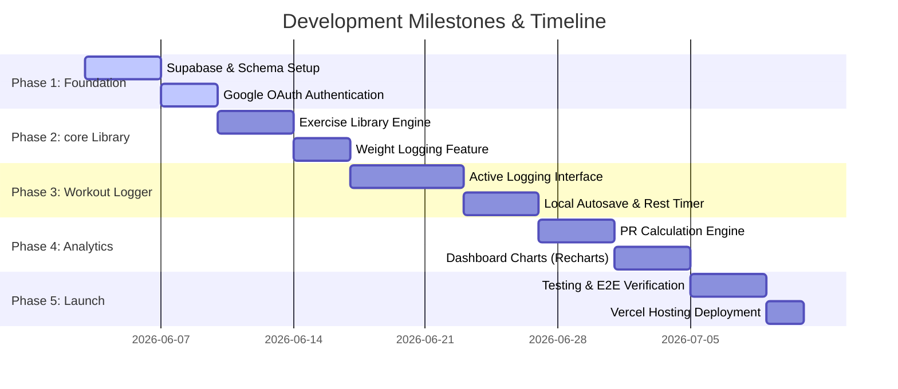

# Development Roadmap

This document maps out the development lifecycle, phases, milestone definitions, and timelines for building **THE TRACKER**.

---

## 1. Gantt Timeline

---

## 2. Phase Breakdown

### Phase 1: Project Foundation (Week 1)
* **Objective**: Configure environments, establish the Postgres schema, and implement login mechanics.
* **Milestones**:
  * [ ] Initialize Next.js project with Tailwind CSS and shadcn/ui.
  * [ ] Establish local Supabase Docker instance and deploy initial database schemas (`profiles`, `exercises`).
  * [ ] Wire up Google OAuth redirect handler in Next.js Middleware.
  * [ ] Verify that a user profile row is successfully written to Postgres upon login.

### Phase 2: Core Library & Profile Metrics (Week 2)
* **Objective**: Create the core database nodes and write standard search utilities.
* **Milestones**:
  * [ ] Seed the database with 100+ standard muscle-grouped exercises.
  * [ ] Build the Exercise selection UI with muscle-group filter badges.
  * [ ] Build the Custom Exercise creator modal.
  * [ ] Develop the weight logs form and chronological table.
  * [ ] Implement daily weight overwrite constraints (`UNIQUE` index).

### Phase 3: Active Workout Engine (Weeks 3–4)
* **Objective**: Develop the core user interface of the application, focusing on active session tracking.
* **Milestones**:
  * [ ] Build the active workout screen (`/workout/active`).
  * [ ] Create the draggable workout card set manager rows.
  * [ ] Connect local storage synchronization hooks (`useLocalStorage`) to capture draft state.
  * [ ] Implement the automated stopwatch rest timer displaying as a bottom slide-up overlay.
  * [ ] Create Next.js Server Actions to save completed sessions to database schemas.

### Phase 4: PR Engine & Dashboard Analytics (Week 5)
* **Objective**: Process raw training inputs to provide mathematical insights and clean progress visualizations.
* **Milestones**:
  * [ ] Build database calculations calculating Epley-based 1-Rep Max values.
  * [ ] Create the `personal_records` cache table and trigger checks.
  * [ ] Render weight tracking trends using Recharts.
  * [ ] Render muscle group set splits (doughnut chart) and weekly volume trends.

### Phase 5: Testing, Polish & Release (Week 6)
* **Objective**: Guarantee application reliability under poor networking conditions and publish the application to production hosting.
* **Milestones**:
  * [ ] Write unit tests for the 1RM math calculations using Vitest.
  * [ ] Configure integration tests for Server Actions.
  * [ ] Write E2E Playwright tests checking the authentication callback and workout logging flows.
  * [ ] Connect GitHub repository to Vercel for automated pipeline deployments.
  * [ ] Enable database backups and production RLS validation.
