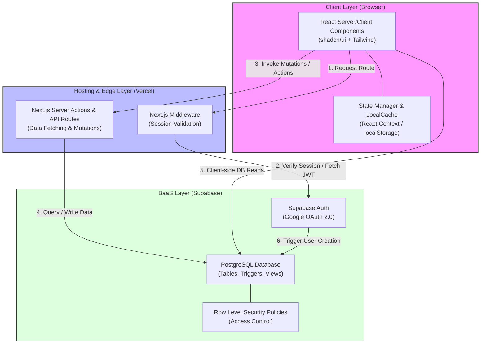
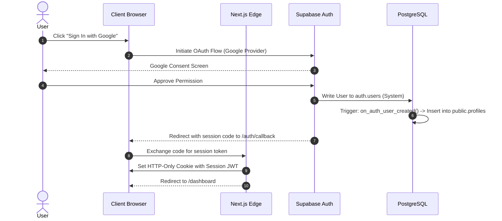
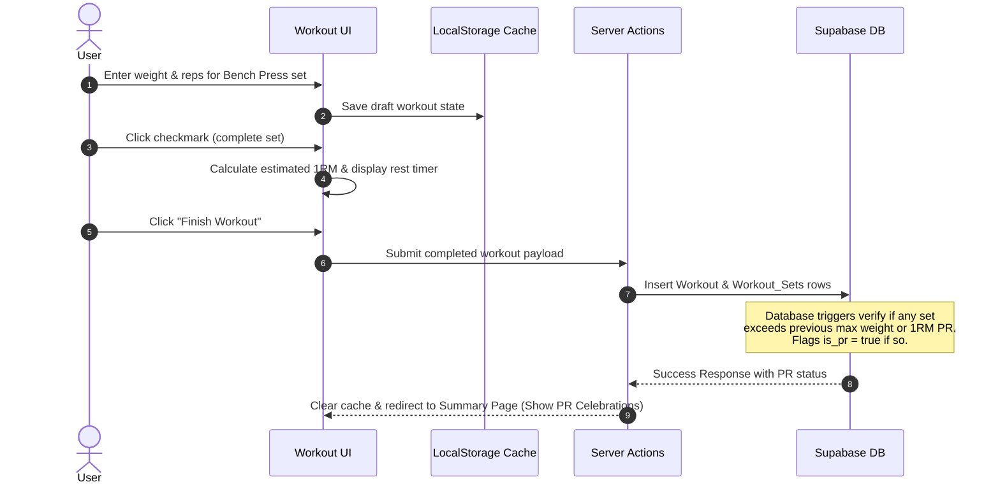

# System Architecture

This document describes the high-level system architecture, component relationships, data flow, and technologies powering **THE TRACKER**.

---

## 1. High-Level Component Architecture

"THE TRACKER" uses a hybrid modern stack combining a **Serverless/Edge Frontend** (Next.js 14) and a **Backend-as-a-Service (BaaS)** (Supabase) backed by a relational database (**PostgreSQL**).

---

## 2. Frontend Architecture: Next.js 14 App Router

The application is structured around the Next.js App Router, utilizing **React Server Components (RSC)** by default and opting into **Client Components** (`"use client"`) only when user interactivity is required.

### Server Components vs. Client Components Strategy
* **Server Components (`app/dashboard/page.tsx`, `app/exercises/page.tsx`)**:
  * Used for fetching static system data (such as the default exercise library) and performing initial page renders directly at the edge.
  * Direct secure database queries using the Supabase Server Client.
  * Reduces JavaScript bundle size shipped to the client.
* **Client Components (`components/workout/workout-logger.tsx`, `components/weight/weight-form.tsx`)**:
  * Used for interactive features that require immediate state updates (e.g., ticking set checkboxes, typing weights/reps, running the active stopwatch rest timer).
  * Submits data to the backend using **Next.js Server Actions** or Supabase Client SDK calls.

### Application State & Offline Resilience
* **Core Global State**: Provided by standard React Context (e.g., `AuthContext` to track user profiles).
* **Workout Logging State**: Managed locally in state within the active workout view, backed by a synchronization hook to `localStorage` (via a customized `useLocalStorage` React hook). This ensures that if the browser crashes, refreshes, or loses internet connectivity in the gym, the user's progress is entirely recoverable.

---

## 3. Backend Architecture: Supabase BaaS

Supabase serves as the backend platform, providing database, authentication, and security services.

### Supabase Auth
* Handles authentication through a Google OAuth provider connection.
* Manages JSON Web Tokens (JWTs) and refresh tokens.
* Next.js Middleware reads the session cookies, extracting the JWT, and validates it prior to completing server rendering.

### PostgreSQL Database & RLS
* A relational schema designed with constraints and indexes (see **[Database Design](DATABASE_DESIGN.md)**).
* **Row Level Security (RLS)** is enabled on all tables, ensuring that data isolation is enforced at the database level. Even if client-side code is compromised or a malicious user attempts to query the Supabase REST API directly, they can only view data where:
  
  $$\text{auth.uid()} = \text{user\_id}$$

---

## 4. Key Architectural Data Flows

### A. Authentication & Session Setup

### B. Workout Logging and PR Evaluation

